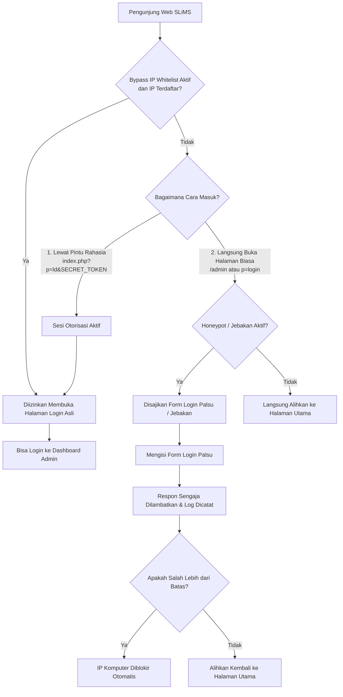
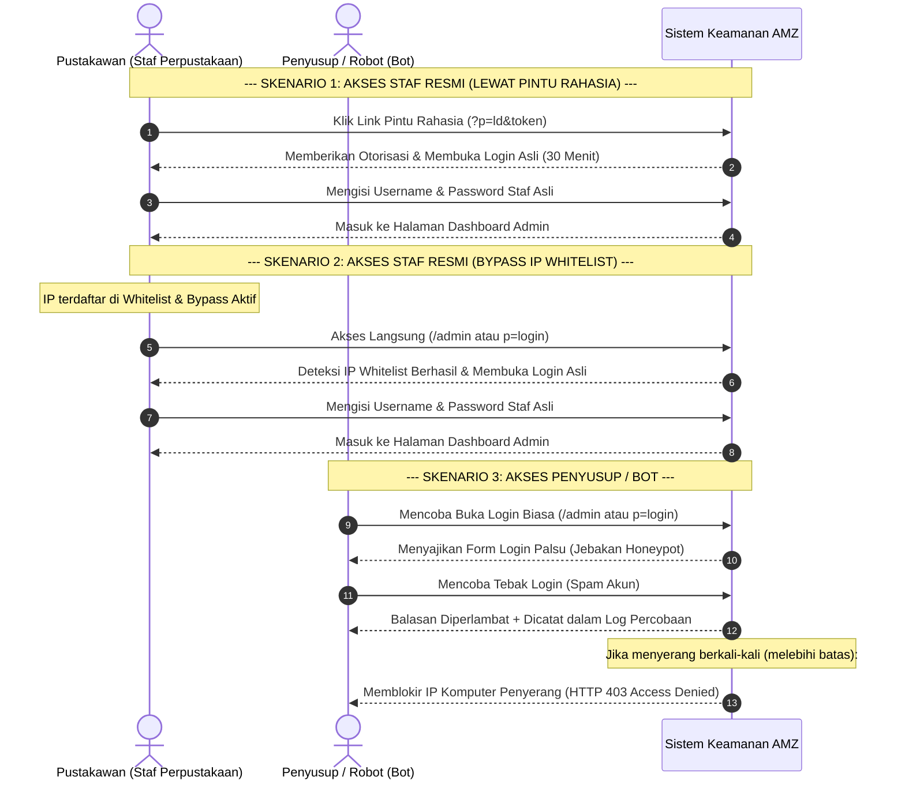

# 🛡️ AMZ Login Decoy — Dokumen Konsep & Petunjuk Penggunaan

Dokumen ini mendokumentasikan konsep, alur kerja detail, dan petunjuk operasional untuk plugin **Decoy Login** pada SLiMS 9 Bulian tanpa mengubah berkas *core* SLiMS di luar folder `plugins/`.

---

## ⚡ TL;DR (Latar Belakang & Solusi)

*   **Masalah**: Halaman `/admin` bawaan SLiMS sangat rawan serangan *Brute Force* (tebak password) dari bot peretas. Penggunaan 2FA (OTP SMS/WA/Email) tidak mencegah bot membombardir server dan kueri database, bahkan membebani biaya & memicu lockout jika sistem gateway gangguan.
*   **Solusi**: 
    1.  **Pintu Rahasia**: Login resmi dipindah ke URL rahasia (contoh: `?p=ld&token123`).
    2.  **Jebakan Honeypot**: Halaman `/admin` biasa disulap menjadi login palsu (honeypot) dengan respon yang sengaja diperlambat (delay 3 detik) untuk mematikan kinerja bot.
    3.  **Auto-Block**: IP penyerang diblokir instan (HTTP 403) setelah 10 kali gagal, tanpa membebani database.
    4.  **Bypass IP Lokal**: Pustakawan di jaringan lokal (seperti `192.168.*`, `10.*`) otomatis dilewatkan langsung ke login asli tanpa perlu link rahasia.

### 📖 Contoh Kasus
1.  **Ibu Budi (Pustakawan Kantor)**: Mengakses `/admin` dari IP lokal perpustakaan $\rightarrow$ **Masuk Instan**.
2.  **Pak Budi (WFH / Rumah)**: Mengakses `?p=ld&tokenrahasia99` $\rightarrow$ **Sesi Aktif 30 Menit $\rightarrow$ Bisa Login**.
3.  **Bot Peretas / Hacker**: Mengakses `/admin` $\rightarrow$ **Masuk Jebakan Honeypot $\rightarrow$ Delay 3 Detik $\rightarrow$ 10x Percobaan $\rightarrow$ IP Diblokir Total (403)**.

---

> [!WARNING]
> **PENTING SAAT UJI COBA (TRIAL):**
> Hati-hati saat melakukan pengujian dengan sengaja memicu decoy login atau mengetik token salah secara berturut-turut. IP Address Anda dapat terblokir secara otomatis oleh sistem pertahanan jika melebihi batas percobaan (`block_threshold`, default: 10 kali).
> 
> **Cara Membuka Blokir IP:**
> Jika IP Anda terlanjur terblokir (mengakses halaman SLiMS akan memunculkan pesan "Access denied" / HTTP 403), Anda harus masuk ke database MySQL (misalnya lewat phpMyAdmin atau terminal) dan menghapus baris IP Anda pada tabel `amzld_blocked_ips`:
> ```sql
> DELETE FROM amzld_blocked_ips WHERE ip_address = 'IP_ADDRESS_ANDA';
> ```
> *(Catatan: Jika opsi `.htaccess_block_enabled` diaktifkan, Anda juga harus membuka file `.htaccess` pada direktori root SLiMS dan menghapus baris aturan blokir IP Anda secara manual).*
>
> **Cara Cepat Menonaktifkan Plugin Jika SLiMS Mengalami Error:**
> Jika SLiMS Anda mengalami error setelah pemasangan plugin atau Anda terkunci dari halaman login, Anda dapat menonaktifkan plugin ini secara cepat dengan mengubah nama folder `amz_login_decoy` di dalam direktori `plugins/` menjadi nama lain, misalnya `amz_login_decoy_nonaktif`. SLiMS akan secara otomatis mengabaikan plugin tersebut dan memulihkan halaman login bawaan.

---

## 🚀 Status Implementasi v1.0.0
Plugin diimplementasikan secara **modular** (tidak ada satu pun file melebihi 1000 baris) di `plugins/amz_login_decoy/` dengan susunan berikut:
```text
plugins/amz_login_decoy/
├── amz_login_decoy.plugin.php   # Entry point utama untuk hook & menu
├── helper.php                   # Loader modul-modul di parts/
├── admin.php                    # Router tipis halaman admin settings
├── opac_menu.php                # Router tipis OPAC p=ld (pintu rahasia)
├── parts/
│   ├── core_utils.php           # Inisialisasi DB, default settings, CRUD settings EAV
│   ├── ip_utils.php             # Logika IP, CIDR, Whitelist, Proxy Headers (Cloudflare)
│   ├── log_utils.php            # Logika logging attempts, alerting rate limit, mail, audit log
│   ├── request_handlers.php     # Pengendali rute request (GET/POST) & rendering honeypot
│   ├── admin_dashboard.php      # Layout dasbor dan setting panel admin
│   └── admin_audit_modal.php    # Layout popup modal log audit tindakan admin
├── migration/
│   └── 1_CreateInitialSettings.php # Migrasi inisialisasi awal skema DB
└── assets/
    └── admin.css                # CSS dasbor admin premium ber-prefix
```

### Catatan Penting Hasil Implementasi:
1.  **Arsitektur Modular**: Seluruh fungsionalitas dipisahkan ke dalam berkas logis di folder `parts/` agar kode tetap teratur, mudah diaudit, dan tidak melebihi **1000 baris per berkas**.
2.  **Isolasi Data**: Pengaturan disimpan di tabel plugin khusus `amzld_settings`, bukan di tabel core `setting`, agar konfigurasi terisolasi dan mengikuti pola lokal repository ini.
3.  **Pencatatan Ganda & Agregasi Cerdas**: Percobaan akses disimpan secara detail di tabel `amzld_attempts` dengan penggabungan baris unik (IP + Event + Target) menggunakan koma untuk mendaftar username dan panjang password unik guna mencegah database bloat. Ringkasan umum tetap dicatat ke tabel core `system_log`.
4.  **Honeypot Aman**: Honeypot tidak menyimpan password mentah. Plugin hanya mengumpulkan nama akun/username dan panjang password yang dicoba.
5.  **Auto-block Runtime**: Pemblokiran IP otomatis berjalan di level runtime PHP melalui tabel `amzld_blocked_ips`.
6.  **Penulisan .htaccess**: Tersedia sebagai opsi (`htaccess_block_enabled`), tetapi dinonaktifkan secara default untuk melindungi file konfigurasi server dari penulisan yang salah.
7.  **Token Default**: URL rahasia default adalah `index.php?p=ld&loginstaf123`. Token ini wajib diganti setelah pemasangan.

---

## 📋 1. Latar Belakang, Masalah & Mengapa Menolak 2FA
Saat ini, URL login standar SLiMS:
1.  OPAC Member Login: `index.php?p=login`
2.  Staff Admin Login: `/admin` (atau `/admin/index.php`)

URL tersebut sangat mudah ditebak dan sering menjadi target serangan pemindaian otomatis (*bot scanning*) serta percobaan masuk secara paksa (*brute force*). Hal ini menyebabkan beban server meningkat (konsumsi CPU/RAM tinggi) akibat penanganan *request* berulang dari bot.

### 🚫 Mengapa Tidak Memilih Autentikasi Dua Faktor (2FA)?
Meskipun 2FA (seperti OTP SMS, Google Authenticator, atau Email OTP) sangat baik untuk mengamankan akun, metode ini tidak cocok dijadikan solusi pertahanan utama untuk SLiMS karena beberapa alasan berikut:
1. **Beban Server Tetap Tinggi**: 2FA baru berjalan *setelah* database memproses kueri username dan password. Artinya, bot brute force masih bebas membombardir halaman login SLiMS dan membebani server secara terus-menerus.
2. **Keterbatasan Sistem & Biaya**: Pengiriman OTP via SMS atau WhatsApp membutuhkan gateway berbayar, sementara SMTP Email sering mengalami delay/penyaringan spam yang mengganggu proses kerja perpustakaan.
3. **Kendala Akses Staf**: Staf pustakawan tidak selalu memiliki atau diperbolehkan memegang perangkat seluler aktif di area kerja tertentu (seperti ruang sirkulasi atau ruang bawah tanah yang minim sinyal).
4. **Resiko Terkunci Massal (Staff Lockout)**: Jika server email atau SMS gateway mengalami kegagalan sistem, pustakawan tidak dapat masuk dan seluruh layanan sirkulasi perpustakaan akan lumpuh seketika.

Oleh karena itu, sistem **Decoy Login & Secret entrance** dipilih karena menyaring penyerang secara pasif di level akses awal sebelum beban query autentikasi dijalankan, tanpa membutuhkan layanan pihak ketiga berbayar dan tanpa mengganggu kelancaran login pustakawan.

---

## 💡 2. Solusi Konseptual: Decoy Login (Umpan) & Secret URL
Sistem keamanan ini memindahkan pintu masuk asli staf ke URL rahasia, sementara pintu masuk lama dijadikan umpan (*decoy*) untuk menjebak bot.

### A. URL Baru yang Didefinisikan
1.  **Decoy Paths (Umpan/Jebakan)**:
    *   Halaman login OPAC standard (`index.php?p=login`)
    *   Direktori Admin (`/admin` atau `/admin/index.php` untuk pengunjung yang belum masuk sesi login)
2.  **Real Login Path (Pintu Asli)**:
    *   `index.php?p=ld&CUSTOMURLUSER` (Contoh: `index.php?p=ld&loginstaf123`)

---

## 🔄 3. Alur Kerja Keamanan (Sederhana & Mudah Dipahami)

Untuk memudahkan pemahaman orang awam, berikut adalah alur jalannya sistem keamanan AMZ Login Decoy:

### A. Diagram Alur Masuk (Flowchart)
Diagram ini menjelaskan langkah yang dilalui oleh setiap pengunjung website SLiMS:



### B. Perbandingan Alur Akses (Pustakawan vs Penyusup)
Diagram ini membandingkan interaksi Pustakawan yang sah dengan penyusup atau robot (*bot*):



---

## 🛡️ 4. Alur & Konsekuensi Akses Berdasarkan Skenario (Detail)

### Skenario 1: Akses ke URL Umpan (`index.php?p=login` atau `index.php?p=loginstaf`)
*   **Target**: Bot pemindai otomatis yang menargetkan halaman login publik.
*   **Apa yang Terjadi**:
    1.  **Honeypot Form**: Plugin menyajikan form login palsu (*honeypot*) yang identik dengan login asli SLiMS.
    2.  **Respon Lambat (Sleep)**: Setiap kali form disubmit, server akan menunda respon secara sengaja menggunakan `sleep(3)` (default 3 detik) untuk membebani dan memperlambat kinerja *resource* bot penyerang.
    3.  **Pencatatan Log & Agregasi**: 
        *   Tabel `amzld_attempts` mencatat percobaan secara cerdas. Jika IP, Event, dan Target sama, record lama akan diupdate: menaikkan counter, mengupdate `updated_at`, dan menggabungkan username & panjang password unik dengan pemisah koma (misal: username: `admin, guest`, panjang password: `5, 8`). Password asli **tidak pernah disimpan** di database.
        *   Tabel core `system_log` mencatat entri log bertipe `'system'`.
    4.  **Notifikasi Email**: Jika jumlah percobaan dari IP tersebut mencapai `email_threshold` (default 5 kali) dalam 1 jam, email peringatan akan dikirimkan ke admin.
    5.  **Pemblokiran Otomatis**: Jika mencapai `block_threshold` (default 10 kali), IP penyerang dicatat ke `amzld_blocked_ips` dan langsung diblokir runtime (HTTP 403).

### Skenario 2: Akses ke Direktori Admin (`/admin` atau `/admin/index.php`)
*   **Target**: Pengguna biasa, bot, atau staf yang mencoba masuk ke halaman admin secara langsung.
*   **Kondisi A - Staf Sudah Login**:
    *   Jika `$_SESSION['uid']` aktif, akses diizinkan dan staf masuk ke dashboard admin tanpa kendala.
*   **Kondisi B - Pengunjung Belum Login**:
    1.  Plugin akan memeriksa sesi otorisasi rahasia `$_SESSION['amzld_can_access_staff_login']` dan masa berlakunya (`session_ttl_minutes`, default 30 menit).
    2.  **Jika sesi otorisasi aktif**: Form login staf resmi asli ditampilkan agar staf dapat memasukkan username & password mereka secara normal.
    3.  **Jika sesi otorisasi TIDAK aktif**:
        *   Akses dianggap ilegal.
        *   Sistem mencatat percobaan ke tabel `amzld_attempts` dan tabel core `system_log`.
        *   Evaluasi rate-limit IP berjalan.
        *   **Honeypot Decoy (Jebakan)**: Jika opsi `honeypot_enabled` aktif, pengunjung akan disajikan **Halaman Login Umpan Palsu** secara instan (menggunakan base path injector `<base>` agar aset CSS/JS termuat sempurna). Jika mereka mencoba submit form tersebut (POST), sistem merekam sebagai `honeypot_submit` dengan detail nama akun & panjang password yang digunakan, menerapkan delay respon, mengevaluasi status blokir, dan menyajikan pesan error palsu "Wrong username or password".
        *   Jika opsi `honeypot_enabled` nonaktif, mereka langsung dialihkan (*HTTP 302 Redirect*) ke beranda utama (`index.php`).

### Skenario 3: Akses ke Pintu Rahasia OPAC (`index.php?p=ld`)
*   **Target**: Staf perpustakaan yang sah untuk membuka otorisasi akses halaman login.
*   **Kondisi A - Dengan Token Rahasia Valid** (Contoh: `index.php?p=ld&loginstaf123`):
    1.  Plugin memvalidasi kecocokan token dengan konfigurasi aktif di database.
    2.  Jika valid, sistem memberikan otorisasi sementara: `$_SESSION['amzld_can_access_staff_login'] = true` dan mencatat waktu mulai otorisasi (`$_SESSION['amzld_authorized_at'] = time()`).
    3.  Staf dialihkan ke `/admin/index.php` dan form login resmi ditampilkan.
*   **Kondisi B - Tanpa Token atau Token Salah** (Contoh: `index.php?p=ld` atau `index.php?p=ld&token_salah`):
    1.  Upaya akses ditandai sebagai ilegal.
    2.  Pencatatan log disimpan pada `amzld_attempts` dan core `system_log`.
    3.  Memicu evaluasi rate-limit IP (menambah hit pemblokiran).
    4.  Pengguna langsung dialihkan ke beranda OPAC (`index.php`).

---

## ⚙️ 5. Integrasi Database & Pengaturan di SLiMS

### A. Isolasi Konfigurasi pada Tabel Plugin (`amzld_settings`)
Untuk menyimpan token rahasia login staff (`CUSTOMURLUSER`), konfigurasi email notifikasi, serta daftar IP whitelist dan parameter operasional lainnya, plugin menyimpan pengaturannya secara terisolasi pada tabel khusus `amzld_settings` menggunakan pasangan key-value string murni tanpa membebani tabel inti core SLiMS (`setting`).

Struktur tabel `amzld_settings`:
- `setting_key`: Kunci unik konfigurasi (`VARCHAR(100)`)
- `setting_value`: Nilai konfigurasi (`TEXT`)
- `updated_at`: Waktu pembaharuan terakhir (`DATETIME`)

Daftar parameter konfigurasi bawaan yang terdaftar:
*   `secret_token`: Token rahasia URL login (default: token acak 10-byte hex).
*   `alert_email`: Alamat email penerima peringatan (default: kosong).
*   `whitelist_ips`: Baris IP yang dikecualikan dari pemblokiran (default: `127.0.0.1` & `::1`).
*   `honeypot_enabled`: Status aktif form login palsu umpan (`1` atau `0`, default: `1`).
*   `honeypot_delay_seconds`: Durasi penundaan respon `sleep()` dalam detik (default: `3`).
*   `email_threshold`: Batas percobaan dari IP sama sebelum notifikasi email dikirimkan (default: `5`).
*   `email_cooldown_minutes`: Jeda minimal pengiriman email peringatan berikutnya dalam menit (default: `60`).
*   `session_ttl_minutes`: Durasi masa aktif sesi otorisasi setelah token rahasia valid dimasukkan (default: `30`).
*   `auto_block_enabled`: Status blokir otomatis level runtime PHP (`1` atau `0`, default: `1`).
*   `block_threshold`: Batas percobaan dari IP sama sebelum pemblokiran otomatis dipicu (default: `10`).
*   `block_duration_minutes`: Durasi pemblokiran IP dalam menit (default: `1440` atau 24 jam).
*   `htaccess_block_enabled`: Pilihan untuk menulis aturan larangan akses IP langsung ke file `.htaccess` (default: `0`).
*   `trust_cf_header`: Pilihan memercayai header proxy Cloudflare `CF-Connecting-IP` (default: `0`).
*   `whitelist_bypass_enabled`: Mengizinkan IP di whitelist melewati saringan honeypot dan langsung login (default: `1`).
*   `log_honeypot_views`: Mencatat kunjungan tampilan form honeypot ke log percobaan (default: `0`).
*   `log_blocked_denials`: Mencatat penolakan akses IP yang terblokir ke log percobaan (default: `0`).
*   `log_prune_days`: Durasi penyimpanan riwayat log dalam hari sebelum otomatis dibersihkan (default: `30`).

### B. Halaman Pengaturan Admin
Plugin mendaftarkan submenu di modul **System** SLiMS:
```php
$plugin->registerMenu('system', 'Decoy Login Config', __DIR__ . '/admin.php');
```
Halaman dasbor premium ini menyajikan:
1.  **Status Keamanan & Konfigurasi**: Form untuk memodifikasi token rahasia, email notifikasi, daftar IP Whitelist, dan semua parameter threshold/delay di atas.
2.  **Statistik & Laporan Serangan**: Kartu informasi (total percobaan, IP terblokir aktif, event honeypot, total audit, dsb) serta tabel log serangan/percobaan masuk.
3.  **Daftar Blokir IP**: Tabel interaktif untuk meninjau dan menghapus IP yang terblokir secara runtime.
4.  **Log Audit Tindakan Admin**: Histori perubahan konfigurasi oleh admin yang dipantau melalui modal popup interaktif.

### C. Halaman OPAC untuk Pintu Masuk Staff (`p=ld`)
Agar URL rahasia `index.php?p=ld` dapat dikenal dan dilayani oleh SLiMS sebagai halaman kustom OPAC, plugin mendaftarkannya dengan pemanggilan berikut:
```php
$plugin->registerMenu('opac', 'ld', __DIR__ . '/opac_menu.php');
```

---

## 📊 6. Pencatatan Laporan (`system_log`)
Setiap kali ada bot yang terjebak mengakses URL umpan atau URL rahasia tanpa token, plugin akan mencatat ke tabel `system_log` bawaan SLiMS agar dapat dipantau langsung oleh admin perpustakaan melalui menu **System > System Log**.

Mekanisme pencatatan menggunakan fungsi bawaan:
```php
utility::writeLogs(
    $dbs, 
    'system', 
    'amz_login_decoy', 
    'Decoy Login', 
    $safeMessage, 
    'Login Guard', 
    'Block'
);
```
